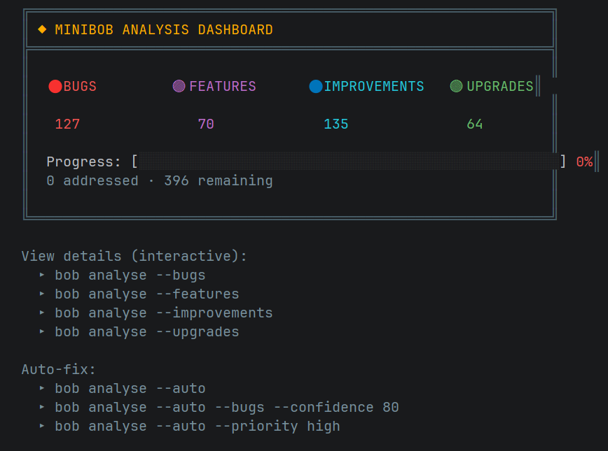

// File: README.md
<div align="center">

# ◉ Bob's CLI

### Your AI Engineering Partner — In Your Terminal

[](https://www.npmjs.com/package/@bobsworkshop/cli)
[](https://nodejs.org)
[](https://opensource.org/licenses/MIT)

**Bob's CLI** is a locally-installed developer tool that provides a senior-level AI engineering partner directly inside your native terminal. Stay in your development environment. Never switch to a browser. Ship faster.


[Installation](#installation) · [Quick Start](#quick-start) · [Features](#features) · [Docs](https://seedling-io.gitbook.io/bob-cli/)

---

*Built by [Bob's Workshop](https://bobs-workshop.web.app) — A Seedling Company*

</div>

---

## Why Bob's CLI?

Every other AI coding assistant lives in a browser, disconnected from your actual workflow. Bob lives where your code lives — in your terminal. He sees your files, understands your architecture, writes code with your approval, and learns how YOU work over time.

| Feature | Bob's CLI | Claude Code | Copilot | Cursor |
|---------|-----------|-------------|---------|--------|
| Local file awareness | ✅ | ✅ | ✅ | ✅ |
| Zero-cost local model | ✅ | ✅ | ❌ | ❌ |
| Behavioral profiling | ✅ | ❌ | ❌ | ❌ |
| Personalization Mode | ✅ | ❌ | ❌ | ❌ |
| Conversation persistence | ✅ | ✅ | ❌ | Partial |
| Deep Dives & Forks | ✅ | ❌ | ❌ | ❌ |
| Remote execution (SovereignLink) | ✅ | Partial | ❌ | ❌ |
| Cross-surface sync (CLI ↔ Web) | ✅ | ✅ | ❌ | ❌ |
| Autonomous code repair | ✅ | ✅ | ❌ | ✅ |
| Source code stays on-device | ✅ | ✅ | ❌ | ✅ |

---

## Installation

```bash
pnpm add -g @bobsworkshop/cli
```

Or with npm:

```bash
npm install -g @bobsworkshop/cli
```

Verify:

```bash
bob whoami
```

**Requirements:**
- Node.js 18+
- Any terminal (VS Code, Android Studio, Windows Terminal, iTerm, PowerShell)
- For local AI: [Ollama](https://ollama.com) with a downloaded model
- For platform features: A [Bob's Workshop](https://bobs-workshop.web.app) account

> 📖 Full setup guide: https://seedling-io.gitbook.io/bob-cli/

---

## Quick Start

### Local-First (Free)

```bash
bob chat "hello, what can you help me with?"
```

Bob auto-detects Ollama running on your machine. No configuration needed. No internet. No API keys. No cost. Your code never leaves your machine.

### Platform (Subscribers)

```bash
bob login
bob chat "help me refactor this service"
```

Sync to web. Access Claude, Gemini, deep dives, forks, and personalization.

---

## First Run Experience

When you first install Bob's CLI, you're greeted with a branded welcome screen:


---

## Features

| Feature | Description |
|---------|-------------|
| **Chat** | AI coding partner with automatic file discovery |
| **Consult** | Strategic advice, no code output |
| **Index** | AI-powered project understanding |
| **Analyse** | Full QA code review with auto-fix |
| **Autonomy** | Autonomous repair across entire codebase |
| **Profile** | Behavioral DNA profiling + dashboard |
| **Deep Dive** | Sandboxed exploration on any message |
| **Fork** | Branch conversations into sub-projects |
| **SovereignLink** | Remote execution from any device |
| **BYOK** | Bring your own API keys |
| **Push** | Git stage + commit + push in one command |

---

## Code Analysis

Bob performs production-grade QA reviews across your entire codebase — identifying bugs, features, improvements, and upgrades with actionable implementation instructions:



```bash
bob analyse              # Run full code review
bob analyse --results    # View dashboard
bob analyse --auto       # Auto-fix with safety constraints
```

---

## Commands


```
bob chat "question"                # AI coding partner
bob consult "question"             # Strategic advice
bob index                          # Index codebase
bob analyse                        # Code review
bob analyse --auto                 # Auto-fix
bob autonomy                       # Full autonomous repair
bob profile --cloud                # Generate DNA profile
bob profile                        # View dashboard
bob deepdive                       # Sandboxed exploration
bob fork "topic"                   # Branch conversation
bob serve                          # Start SovereignLink
bob remote chat "msg"              # Remote execution
bob push "message"                 # Git push
bob login                          # Authenticate
bob byok set google <key>          # Add BYOK key
bob whoami                         # Status
```

> 📖 Full command reference: https://seedling-io.gitbook.io/bob-cli/bobs-cli-product-wiki-and-user-guide/command-reference

---

## Personalization Mode

Powered by the **Frank Reasoning Engine**. Bob learns how you work and adapts:

- Tone, pacing, and depth matched to your style
- Blind spots proactively addressed
- Emotional state calibrated encouragement

```bash
bob profile --cloud
bob chat --personalized "what should I focus on?"
```

---

## Architecture

```
Tier 1 — Local (Free)              Tier 3 — Platform (Subscription)
─────────────────────────           ─────────────────────────────────
▸ Your model (Ollama)               ▸ Claude / Gemini
▸ Files on your machine             ▸ Conversations sync to web
▸ Local profiling                   ▸ Cloud profiling + Frank Engine
▸ Zero cost                         ▸ Deep dives, forks, remote exec
```

Same commands. Scale without changing tools.

---

## Documentation

- 📖 Full Docs: https://seedling-io.gitbook.io/bob-cli/
- 🌐 Web App: https://bobs-workshop.web.app
- 📦 npm: https://www.npmjs.com/package/@bobsworkshop/cli

---

<div align="center">

**The AI coding tool that learns how you think.**

Bob's CLI · Bob's Workshop · Seedling

*Written by Bob.*

</div>


